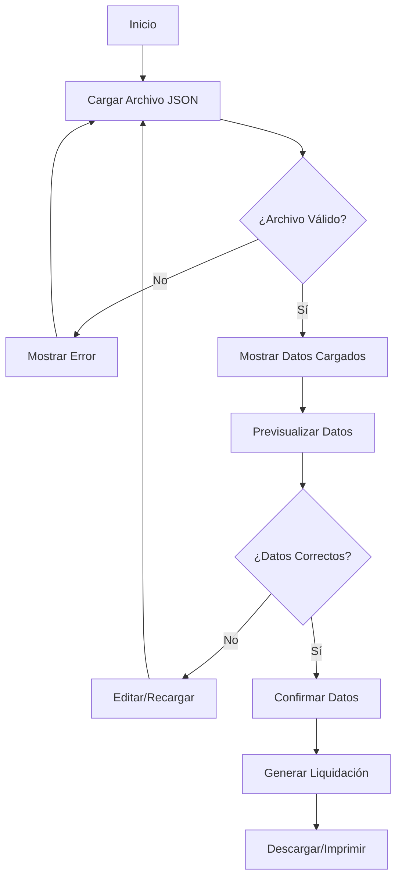
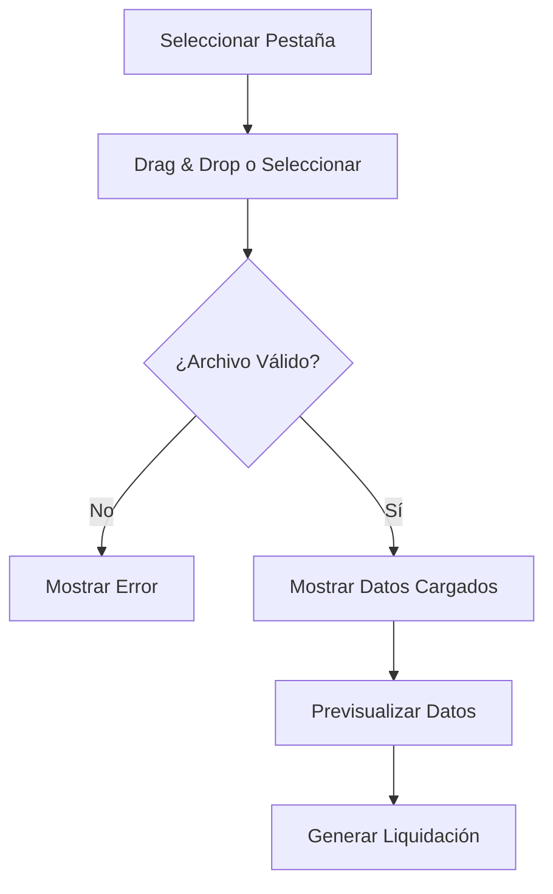
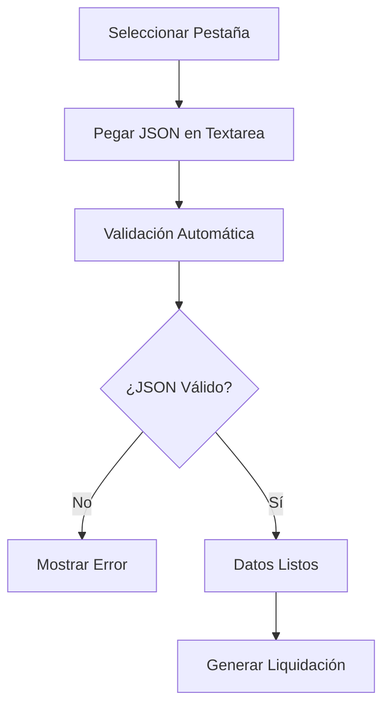
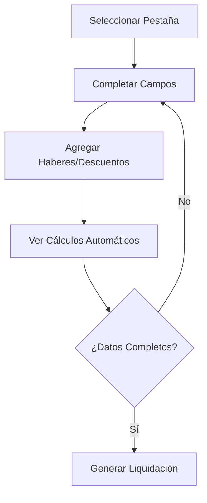
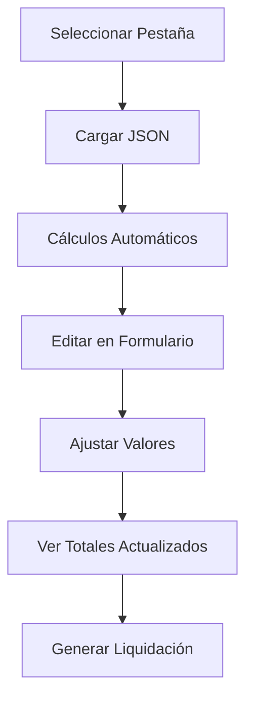

# 📋 Sistema de Generación de Liquidaciones de Sueldo

## 🎯 ¿Qué es este sistema?

Este es un sistema web desarrollado en **Vue.js** que permite generar liquidaciones de sueldo de manera automatizada a partir de datos estructurados en formato JSON. El sistema procesa información de empleadores, trabajadores, haberes, descuentos y genera documentos de liquidación profesionales listos para imprimir o descargar.

## 🚀 ¿Para qué sirve?

- **Automatizar** el proceso de creación de liquidaciones de sueldo
- **Estandarizar** el formato de las liquidaciones según normativas laborales
- **Agilizar** el trabajo de recursos humanos y contabilidad
- **Reducir errores** en cálculos manuales
- **Generar documentos profesionales** con formato consistente

## ⚡ Funcionalidades Implementadas

### 1. **Sistema de Pestañas de Navegación**

- ✅ **📂 Subir JSON**: Carga de archivos JSON mediante drag & drop o selección
- ✅ **✏️ Pegar JSON**: Entrada manual de datos JSON con validación en tiempo real
- ✅ **📝 Formulario**: Formulario interactivo completo para entrada manual de datos
- ✅ **📤 Cargar y Editar**: Combinación de carga JSON + edición en formulario
- ✅ Transiciones suaves entre pestañas
- ✅ Estado persistente de navegación

### 2. **Carga de Logo Personalizado**

- ✅ **Carga dinámica de logo**: Selección de imagen personalizada para liquidaciones
- ✅ **Preview en tiempo real**: Vista previa del logo seleccionado
- ✅ **Múltiples formatos**: Acepta JPG, PNG, SVG y otros formatos de imagen
- ✅ **Conversión automática**: Base64 automático para uso en documentos
- ✅ **Logo por defecto**: Fallback al logo de Piscícola Huililco si no se carga uno personalizado
- ✅ **Gestión de logo**: Opción para cambiar o quitar logo cargado

### 3. **Carga y Validación de Datos**

- ✅ **Drag & Drop avanzado**: Zona de arrastre con feedback visual y validaciones
- ✅ **Validación automática**: Estructura JSON, tipos de datos y campos obligatorios
- ✅ **Detección de errores**: Mensajes descriptivos para errores de formato
- ✅ **Múltiples métodos de entrada**: Archivo, pegado manual, formulario
- ✅ **Feedback visual**: Indicadores de estado, spinners de carga, mensajes de éxito/error

### 4. **Previsualización de Datos**

- ✅ **Modal de previsualización completa** con scroll independiente
- ✅ **Visualización organizada por secciones**:
  - 🏢 Información del Empleador
  - 👤 Información del Trabajador
  - 💰 Información Salarial
  - ➕ Haberes Imponibles
  - 💰 Haberes No Imponibles
  - ⚖️ Descuentos Legales
  - ➖ Otros Descuentos
  - 📊 Resumen Financiero
- ✅ **Cálculos automáticos** de totales en tiempo real
- ✅ **Formato de moneda chilena** (CLP) con separadores de miles
- ✅ **Scroll dual**: Modal y página con scroll independiente

### 5. **Formulario Interactivo Completo**

- ✅ **Campos organizados por secciones** con validación en tiempo real
- ✅ **Listas dinámicas**: Agregar/quitar haberes y descuentos
- ✅ **Cálculos automáticos**:
  - 📐 Sueldo proporcional según días trabajados
  - 🧮 AFP Provida (11.45%), Fonasa (7%), Seguro Desempleo (0.6%)
  - 📊 Totales actualizados en tiempo real
- ✅ **Validación de campos**: Formatos, rangos y campos obligatorios
- ✅ **Autocompletado inteligente**: Sugerencias basadas en datos anteriores

### 6. **Sistema de Notificaciones**

- ✅ **Toast notifications**: Mensajes emergentes no intrusivos
- ✅ **Múltiples tipos**: Éxito, error, advertencia, información
- ✅ **Auto-dismiss**: Desaparición automática configurable
- ✅ **Gestión global**: Sistema accesible desde cualquier componente

### 7. **Generación de Liquidaciones**

- ✅ **HTML profesional**: Documento con formato estándar chileno
- ✅ **Logo dinámico**: Integración del logo personalizado o por defecto
- ✅ **Cálculos precisos**: Totales, descuentos y líquido a pagar
- ✅ **Formato imprimible**: Optimizado para impresión y PDF
- ✅ **Ventana nueva**: Apertura en ventana separada para mejor manejo

### 8. **Interfaz de Usuario Avanzada**

- ✅ **Diseño responsive**: Adaptación completa a desktop, tablet y móvil
- ✅ **Componentes reutilizables**: Arquitectura modular y mantenible
- ✅ **Transiciones suaves**: Animaciones CSS para mejor experiencia
- ✅ **Estados de carga**: Spinners y indicadores de progreso
- ✅ **Accesibilidad**: Navegación por teclado y lectores de pantalla

## 🔄 Flujos de Usuario Disponibles

### **Flujo Principal: Generación de Liquidación**



### **Opciones Actuales del Usuario**

### **Flujos Específicos por Pestaña**

#### **� Flujo "Subir JSON"**



#### **✏️ Flujo "Pegar JSON"**



#### **📝 Flujo "Formulario"**



#### **📤 Flujo "Cargar y Editar"**



### **Opciones Avanzadas del Usuario**

#### **�️ Gestión de Logo**

1. **Cargar Logo Personalizado**

   - Drag & drop de imagen (JPG, PNG, SVG)
   - Preview inmediato del logo
   - Conversión automática a Base64

2. **Gestionar Logo**
   - Cambiar logo existente
   - Quitar logo (usar por defecto)
   - Preview antes de generar liquidación

#### **📊 Métodos de Entrada de Datos**

1. **📁 Carga de Archivos**

   - Seleccionar desde explorador
   - Arrastrar y soltar en zona designada
   - Validación automática de formato

2. **✏️ Entrada Manual**

   - Pegar JSON directamente
   - Validación en tiempo real
   - Ejemplo de JSON disponible

3. **📝 Formulario Completo**

   - Campos organizados por secciones
   - Listas dinámicas para haberes/descuentos
   - Cálculos automáticos en tiempo real

4. **📤 Híbrido (Cargar + Editar)**
   - Cargar JSON base
   - Editar valores en formulario
   - Cálculos automáticos aplicados

#### **�️ Previsualización Avanzada**

1. **Modal Completo**

   - Todas las secciones organizadas
   - Scroll independiente del modal y página
   - Cálculos y totales en tiempo real

2. **Validación Visual**
   - Verificar todos los datos antes de generar
   - Revisar cálculos automáticos
   - Confirmar o cancelar proceso

#### **🔄 Opciones de Procesamiento**

1. **Cálculos Automáticos**

   - Sueldo proporcional por días trabajados
   - Descuentos legales (AFP, Fonasa, Seguro)
   - Totales actualizados en tiempo real

2. **Validaciones Inteligentes**
   - Campos obligatorios
   - Formatos de datos (RUT, fechas, montos)
   - Consistencia de información

## 📝 Modos de Uso Detallados

### **🚀 Modo 1: Carga Rápida (📂 Subir JSON)**

#### **Paso 1: Cargar Logo (Opcional)**

- Ir a la sección "🖼️ Logo para Liquidación"
- Arrastrar imagen o hacer clic para seleccionar
- Verificar preview del logo

#### **Paso 2: Seleccionar Pestaña**

- Hacer clic en "📂 Subir JSON"

#### **Paso 3: Cargar Archivo**

- **Opción A**: Arrastrar archivo JSON a la zona de carga
- **Opción B**: Hacer clic en "Seleccionar archivo" y elegir desde explorador

#### **Paso 4: Verificar Carga**

- El sistema validará automáticamente el JSON
- Aparecerá mensaje de éxito o error
- Los datos se mostrarán organizados

#### **Paso 5: Previsualizar (Opcional)**

- Hacer clic en "👁️ Previsualizar Datos"
- Revisar todas las secciones en el modal
- Verificar cálculos automáticos

#### **Paso 6: Generar**

- Hacer clic en "➡️ Generar Liquidación"
- Se abrirá nueva ventana con el documento
- Imprimir o guardar como PDF

### **🖊️ Modo 2: Entrada Manual (✏️ Pegar JSON)**

#### **Paso 1: Seleccionar Pestaña**

- Hacer clic en "✏️ Pegar JSON"

#### **Paso 2: Pegar Datos**

- Copiar JSON desde otra fuente
- Pegar en el área de texto
- La validación ocurre en tiempo real

#### **Paso 3: Verificar Formato**

- ✅ Verde: JSON válido
- ❌ Rojo: Error con descripción

#### **Paso 4: Ver Ejemplo (Si es necesario)**

- Expandir "📋 Ver ejemplo de JSON"
- Copiar y modificar según necesidades

#### **Paso 5: Generar**

- Una vez válido, hacer clic en "➡️ Generar Liquidación"

### **📝 Modo 3: Formulario Completo (📝 Formulario)**

#### **Paso 1: Seleccionar Pestaña**

- Hacer clic en "📝 Formulario"

#### **Paso 2: Completar Información Básica**

- **Empleador**: Nombre, RUT, dirección, área
- **Período**: Mes y año de la liquidación
- **Trabajador**: Datos personales y contractuales

#### **Paso 3: Configurar Haberes**

- **Haberes Imponibles**: Usar botón "➕ Agregar" para añadir conceptos
- **Haberes No Imponibles**: Colación, movilización, etc.
- Los totales se calculan automáticamente

#### **Paso 4: Configurar Descuentos**

- **Descuentos Legales**: AFP, Fonasa, Seguro (automáticos)
- **Otros Descuentos**: Préstamos, anticipos, etc.

#### **Paso 5: Verificar Cálculos**

- Los totales se actualizan en tiempo real
- Verificar "📊 Totales Calculados Automáticamente"
- Revisar líquido a recibir

#### **Paso 6: Generar**

- Cuando todos los campos estén completos
- Hacer clic en "➡️ Generar Liquidación"

### **🔄 Modo 4: Híbrido (📤 Cargar y Editar)**

#### **Paso 1: Seleccionar Pestaña**

- Hacer clic en "📤 Cargar y Editar"

#### **Paso 2: Cargar JSON Base**

- **Opción A**: Arrastrar archivo JSON
- **Opción B**: Pegar JSON en área de texto

#### **Paso 3: Verificar Carga**

- El sistema aplicará cálculos automáticos
- Aparecerá mensaje de confirmación
- Se mostrará el formulario completo

#### **Paso 4: Editar Valores**

- Modificar cualquier campo según necesidades
- Cambiar días trabajados (recalcula sueldo proporcional)
- Agregar/quitar haberes y descuentos

#### **Paso 5: Ver Actualizaciones**

- Los cálculos se actualizan automáticamente
- Verificar totales en tiempo real
- Revisar impacto de cambios

#### **Paso 6: Generar**

- Una vez satisfecho con los cambios
- Hacer clic en "➡️ Generar Liquidación"

## 🔧 Componentes del Sistema

### **📱 Componentes de Interfaz**

#### **🗂️ Sistema de Pestañas**

- **UploadTab.vue**: Manejo de carga de archivos con drag & drop
- **PasteTab.vue**: Entrada manual de JSON con validación en tiempo real
- **FormTab.vue**: Formulario completo interactivo con cálculos automáticos
- **LoadEditTab.vue**: Combinación de carga + edición con formulario

#### **🎨 Componentes de UI**

- **DragDropZone.vue**: Zona de arrastre universal para archivos e imágenes
- **DataPreviewModal.vue**: Modal de previsualización con scroll independiente
- **TotalsDisplay.vue**: Visualización de totales con cálculos en tiempo real
- **DynamicList.vue**: Listas editables para haberes y descuentos
- **ToastNotification.vue**: Sistema de notificaciones emergentes
- **ConfirmModal.vue**: Modales de confirmación personalizables
- **StatusIndicator.vue**: Indicadores visuales de estado
- **LoadingSpinner.vue**: Spinners de carga animados

### **⚙️ Servicios del Sistema**

#### **🧮 LiquidacionService.js**

- **Formateo de moneda**: Formato chileno (CLP) con separadores
- **Cálculos automáticos**: Sueldo proporcional, descuentos legales
- **Validaciones**: Estructura de datos, campos obligatorios
- **Utilidades**: Formateo de fechas, números, RUT

#### **📄 LiquidacionGenerator.js**

- **Generación HTML**: Documento profesional para impresión
- **Integración de logo**: Dinámico o por defecto
- **Cálculos finales**: Totales, descuentos, líquido a pagar
- **Apertura de ventana**: Nueva ventana para impresión/PDF

### **🎯 Funcionalidades Técnicas Avanzadas**

#### **🔄 Cálculos Automáticos**

- **Sueldo Proporcional**: `(Sueldo Base × Días Trabajados) ÷ 30`
- **AFP Provida**: `11.45%` del total imponible
- **Fonasa**: `7%` del total imponible
- **Seguro Desempleo**: `0.6%` del total imponible
- **Actualización en tiempo real**: Cambios instantáneos al modificar valores

#### **✅ Validaciones Inteligentes**

- **Estructura JSON**: Verificación de campos obligatorios
- **Formatos de datos**: RUT (XX.XXX.XXX-X), fechas (DD/MM/YYYY)
- **Rangos numéricos**: Montos positivos, días válidos (1-31)
- **Consistencia**: Verificación de totales y cálculos

#### **🖼️ Gestión de Logo Dinámico**

- **Carga de imagen**: Múltiples formatos (JPG, PNG, SVG)
- **Conversión Base64**: Automática para uso en documentos
- **Preview en tiempo real**: Vista previa antes de generar
- **Fallback inteligente**: Logo por defecto si no se carga personalizado

#### **📱 Responsive Design**

- **Breakpoints**: Desktop (>1024px), Tablet (768-1024px), Mobile (<768px)
- **Componentes adaptativos**: Formularios, modales, listas
- **Touch-friendly**: Botones y controles optimizados para móvil
- **Scroll independiente**: Modal y página con scroll separado

## 📊 Estructura del JSON Requerido

### **Campos Obligatorios y Formatos**

```json
{
  "empleador": "string - Nombre completo de la empresa",
  "rut": "string - RUT con formato XX.XXX.XXX-X",
  "direccion": "string - Dirección completa",
  "area": "string - Área o departamento",
  "periodo": "string - Formato: 'Mes YYYY' (ej: 'Junio 2024')",

  "trabajador": {
    "nombre": "string - Nombre completo del trabajador",
    "rut": "string - RUT con formato XX.XXX.XXX-X",
    "cargo": "string - Cargo o posición",
    "inicioContrato": "string - Formato DD/MM/YYYY",
    "sueldoBase": "number - Monto en pesos chilenos sin puntos ni comas",
    "gratificacion": "number - Monto en pesos chilenos",
    "bonoColacion": "number - Monto en pesos chilenos",
    "bonoMovilizacion": "number - Monto en pesos chilenos",
    "cargoFamiliar": "number - Cantidad de cargas familiares"
  },

  "haberesImponibles": [
    {
      "concepto": "string - Descripción del haber",
      "monto": "number - Monto en pesos chilenos"
    }
  ],

  "haberesNoImponibles": [
    {
      "concepto": "string - Descripción del haber",
      "monto": "number - Monto en pesos chilenos"
    }
  ],

  "descuentosLegales": [
    {
      "concepto": "string - Tipo de descuento (AFP, Salud, etc.)",
      "monto": "number - Monto en pesos chilenos"
    }
  ],

  "otrosDescuentos": [
    {
      "concepto": "string - Descripción del descuento",
      "monto": "number - Monto en pesos chilenos"
    }
  ]
}
```

### **Ejemplo Completo de JSON**

```json
{
  "empleador": "Empresa Ejemplo S.A.",
  "rut": "12.345.678-9",
  "direccion": "Av. Providencia 1234, Santiago",
  "area": "Operaciones",
  "periodo": "Junio 2024",

  "trabajador": {
    "nombre": "Juan Carlos Pérez González",
    "rut": "15.554.385-K",
    "cargo": "Desarrollador Senior",
    "inicioContrato": "01/03/2023",
    "sueldoBase": 1200000,
    "gratificacion": 100000,
    "bonoColacion": 50000,
    "bonoMovilizacion": 30000,
    "cargoFamiliar": 2
  },

  "haberesImponibles": [
    {
      "concepto": "Horas Extra",
      "monto": 150000
    }
  ],

  "haberesNoImponibles": [
    {
      "concepto": "Bono Productividad",
      "monto": 75000
    }
  ],

  "descuentosLegales": [
    {
      "concepto": "AFP Provida",
      "monto": 132000
    },
    {
      "concepto": "Fonasa",
      "monto": 98500
    }
  ],

  "otrosDescuentos": [
    {
      "concepto": "Préstamo Empresa",
      "monto": 50000
    }
  ]
}
```

## 📋 Resultado Final del Flujo

Al completar el proceso, el sistema genera:

### **📄 Documento de Liquidación que incluye:**

- ✅ **Encabezado** con datos del empleador y período
- ✅ **Información del trabajador** completa
- ✅ **Detalle de haberes** (imponibles y no imponibles)
- ✅ **Detalle de descuentos** (legales y otros)
- ✅ **Cálculos automáticos** de totales
- ✅ **Líquido a pagar** final
- ✅ **Formato profesional** listo para imprimir
- ✅ **Cumplimiento** de normativas laborales chilenas

### **💾 Opciones de Salida:**

- **Descarga en PDF** para archivo digital
- **Impresión directa** para documentos físicos
- **Vista previa** antes de generar el documento final

---

## 🔧 Notas Técnicas

- **Formato de montos**: Todos los valores monetarios deben ingresarse como números enteros (sin puntos, comas ni símbolos)
- **Formato de fechas**: DD/MM/YYYY para fechas
- **Formato de RUT**: XX.XXX.XXX-X con puntos y guión
- **Codificación**: UTF-8 para caracteres especiales
- **Tamaño máximo**: No hay límite específico para el archivo JSON

---

## 🛠️ Configuración y Desarrollo

### **🚀 Tecnologías Utilizadas**

#### **Frontend**

- **Vue.js 3**: Framework principal con Composition API
- **Vite**: Build tool y servidor de desarrollo
- **CSS3**: Estilos modernos con variables CSS y flexbox
- **JavaScript ES6+**: Sintaxis moderna y módulos

#### **Librerías y Dependencias**

- **@vitejs/plugin-vue**: Plugin de Vite para Vue.js
- **Intl.NumberFormat**: Formateo de números y moneda
- **FileReader API**: Lectura de archivos en el navegador
- **Teleport**: Para modales y notificaciones

### **📁 Estructura del Proyecto**

```
generador-liquidaciones/
├── src/
│   ├── components/          # Componentes Vue reutilizables
│   │   ├── UploadTab.vue   # Carga de archivos
│   │   ├── PasteTab.vue    # Entrada manual JSON
│   │   ├── FormTab.vue     # Formulario completo
│   │   ├── LoadEditTab.vue # Cargar y editar
│   │   ├── DataPreviewModal.vue # Modal previsualización
│   │   ├── DragDropZone.vue     # Zona drag & drop
│   │   ├── TotalsDisplay.vue    # Totales calculados
│   │   ├── DynamicList.vue      # Listas dinámicas
│   │   ├── ToastNotification.vue # Notificaciones
│   │   ├── ConfirmModal.vue     # Modal confirmación
│   │   ├── StatusIndicator.vue  # Indicadores estado
│   │   └── LoadingSpinner.vue   # Spinner carga
│   ├── services/           # Servicios y lógica de negocio
│   │   ├── liquidacionService.js    # Cálculos y validaciones
│   │   └── liquidacionGenerator.js  # Generación HTML
│   ├── assets/            # Recursos estáticos
│   │   └── styles/        # Estilos CSS
│   ├── img/              # Imágenes del proyecto
│   ├── App.vue           # Componente principal
│   └── main.js           # Punto de entrada
├── liquidaciones/        # Archivos JSON de ejemplo
├── public/              # Archivos públicos
├── vite.config.js       # Configuración Vite
├── package.json         # Dependencias del proyecto
└── DOCUMENTACION.md     # Esta documentación
```

### **⚙️ Variables de Configuración**

#### **🎨 Variables CSS Personalizables**

```css
:root {
  /* Colores principales */
  --primary-500: #3b82f6;
  --primary-400: #60a5fa;
  --secondary-500: #10b981;
  --gray-300: #d1d5db;

  /* Espaciado */
  --space-3: 0.75rem;
  --space-4: 1rem;
  --space-6: 1.5rem;
  --space-8: 2rem;

  /* Bordes */
  --radius-2xl: 1rem;
  --shadow-lg: 0 10px 15px -3px rgba(0, 0, 0, 0.1);

  /* Transiciones */
  --transition-normal: all 0.3s ease;
}
```

#### **💰 Configuración de Descuentos Legales**

```javascript
// En liquidacionService.js
const DESCUENTOS_LEGALES = {
  AFP_PROVIDA: 0.1145, // 11.45%
  FONASA: 0.07, // 7%
  SEGURO_DESEMPLEO: 0.006, // 0.6%
};
```

#### **📊 Configuración de Cálculos**

```javascript
// Días estándar por mes
const DIAS_MES_ESTANDAR = 30;

// Límites de validación
const LIMITES = {
  DIAS_MINIMOS: 1,
  DIAS_MAXIMOS: 31,
  SUELDO_MINIMO: 0,
  SUELDO_MAXIMO: 50000000,
};
```

### **🔧 Comandos de Desarrollo**

#### **Instalación**

```bash
# Clonar repositorio
git clone [url-repositorio]
cd generador-liquidaciones

# Instalar dependencias
npm install
```

#### **Desarrollo**

```bash
# Servidor de desarrollo (puerto 3000)
npm run dev

# Build para producción
npm run build

# Preview del build
npm run preview
```

#### **Configuración del Servidor**

```javascript
// vite.config.js
export default defineConfig({
  plugins: [vue()],
  server: {
    port: 3000,
    open: true, // Abre automáticamente en el navegador
  },
});
```

## 🔧 Notas Técnicas Avanzadas

### **📋 Formatos de Datos Requeridos**

#### **💰 Montos**

- **Formato**: Números enteros sin separadores
- **Ejemplo**: `1500000` (no `1.500.000` ni `$1,500,000`)
- **Rango**: 0 a 50,000,000 (50 millones)

#### **📅 Fechas**

- **Formato**: DD/MM/YYYY
- **Ejemplo**: `15/06/2024`
- **Validación**: Fechas válidas del calendario

#### **🆔 RUT**

- **Formato**: XX.XXX.XXX-X con puntos y guión
- **Ejemplo**: `12.345.678-9`
- **Validación**: Dígito verificador correcto

#### **📊 Días Trabajados**

- **Formato**: Número entero
- **Rango**: 1 a 31 días
- **Cálculo**: Afecta sueldo proporcional automáticamente

### **🔒 Validaciones del Sistema**

#### **✅ Validaciones de Entrada**

1. **Estructura JSON**: Campos obligatorios presentes
2. **Tipos de datos**: Números para montos, strings para textos
3. **Formatos específicos**: RUT, fechas, rangos numéricos
4. **Consistencia**: Totales coherentes con datos ingresados

#### **🧮 Validaciones de Cálculo**

1. **Sueldo proporcional**: Coherente con días trabajados
2. **Descuentos legales**: Porcentajes correctos aplicados
3. **Totales**: Suma de haberes menos descuentos
4. **Líquido final**: Cálculo correcto del monto a pagar

### **🚀 Optimizaciones de Performance**

#### **⚡ Carga Rápida**

- **Lazy loading**: Componentes cargados bajo demanda
- **Computed properties**: Cálculos reactivos optimizados
- **Debounce**: Validaciones con retraso para evitar spam

#### **💾 Gestión de Memoria**

- **Cleanup**: Limpieza de event listeners
- **Refs**: Referencias reactivas optimizadas
- **Watch**: Observadores eficientes sin loops infinitos

### **🔐 Seguridad y Privacidad**

#### **🛡️ Seguridad de Datos**

- **Procesamiento local**: Todos los datos se procesan en el navegador
- **Sin envío a servidor**: Información sensible no sale del dispositivo
- **Validación client-side**: Verificaciones antes de procesamiento

#### **🔒 Privacidad**

- **Sin almacenamiento**: Datos no se guardan permanentemente
- **Sesión temporal**: Información se pierde al cerrar navegador
- **Sin tracking**: No hay seguimiento de usuarios

---

## 📚 Recursos Adicionales

### **📖 Documentación Técnica**

- **Vue.js 3**: https://vuejs.org/guide/
- **Vite**: https://vitejs.dev/guide/
- **CSS Variables**: https://developer.mozilla.org/en-US/docs/Web/CSS/Using_CSS_custom_properties

### **🎯 Casos de Uso Reales**

- **Piscícola Huililco**: Liquidaciones mensuales automatizadas
- **Múltiples empleados**: Procesamiento en lote
- **Diferentes períodos**: Histórico de liquidaciones

### **🔄 Actualizaciones y Mantenimiento**

- **Versión actual**: 2.0.0
- **Última actualización**: Diciembre 2024
- **Próximas funcionalidades**: Exportación PDF nativa, múltiples empleados

---

_Sistema desarrollado para automatizar y estandarizar el proceso de generación de liquidaciones de sueldo en Chile. Cumple con normativas laborales vigentes y proporciona cálculos precisos para empresas de todos los tamaños._
