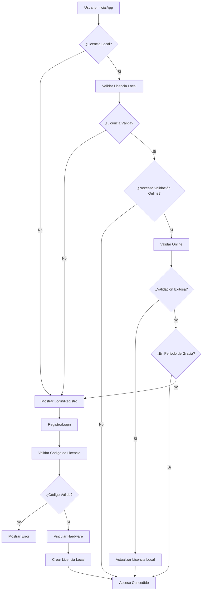

# 🎫 Sistema de Licencias - Liqueen

## Descripción General

El sistema de licencias de Liqueen proporciona un mecanismo robusto de autenticación y autorización basado en códigos de licencia únicos. Implementa validación online/offline, vinculación por hardware y gestión automática de actualizaciones.

## 🏗️ Arquitectura del Sistema

### Componentes Principales

1. **LicenseService** - Gestión central de licencias
2. **HardwareService** - Identificación única de dispositivos
3. **CryptoService** - Encriptación y validación de códigos
4. **UpdateService** - Gestión de actualizaciones automáticas
5. **ElectronService** - Comunicación con APIs del sistema
6. **FirestoreSetup** - Configuración de base de datos

### Flujo de Autenticación



## 🔐 Formato de Códigos de Licencia

### Estructura

- **Formato**: `LIQ-YYYY-XXXX-YYYY-ZZZZ`
- **Longitud**: 23 caracteres (incluyendo guiones)
- **Ejemplo**: `LIQ-2025-A1B2-C3D4-MAIK`

### Componentes

- `LIQ`: Prefijo identificador de Liqueen
- `YYYY`: Año de generación
- `XXXX`: Código alfanumérico único (parte 1)
- `YYYY`: Código alfanumérico único (parte 2)
- `ZZZZ`: Sufijo especial de 4 caracteres aleatorios de las palabras: "MAIKO", "STUDIOS", "SAEZ", "CONTRERAS"

## 🛡️ Seguridad y Encriptación

### Encriptación Local

- **Algoritmo**: AES-256-CBC
- **Clave**: Derivada del Hardware ID + clave base
- **Archivo**: `local.lic` en directorio de datos de usuario

### Hardware Binding

- **Componentes**: Machine ID + características del sistema
- **Hash**: SHA-256 de componentes combinados
- **Validación**: Verificación en cada inicio y validación online

### Validación Online

- **Intervalo**: Cada 30 días
- **Gracia**: 15 días adicionales sin conexión
- **Firestore**: Verificación contra base de datos central

## 📊 Base de Datos (Firestore)

### Colección: `licenses`

```javascript
{
  code: "LIQ-2025-XXXX-YYYY",
  type: "standard|trial|extended",
  status: "available|used|expired|revoked",
  createdAt: timestamp,
  expiryDate: timestamp,
  activatedOn: timestamp,
  userId: string,
  userEmail: string,
  hardwareId: string,
  description: string,
  generatedBy: string,
  validationCount: number,
  lastValidation: timestamp,
  revokedAt: timestamp,
  revokedBy: string
}
```

### Colección: `users`

```javascript
{
  email: string,
  licenseCode: string,
  registeredAt: timestamp,
  lastLogin: timestamp,
  hardwareId: string,
  sessionToken: string,
  isActive: boolean
}
```

### Colección: `app-config`

```javascript
// Documento: version
{
  currentVersion: "2.0.0",
  latestVersion: "2.1.0",
  updateInfo: {
    releaseDate: timestamp,
    changelog: array,
    downloadUrl: string,
    isRequired: boolean,
    minCompatibleVersion: string
  }
}

// Documento: settings
{
  licenseValidationInterval: 30,
  gracePeriodsEnabled: true,
  gracePeriodDays: 15,
  maxOfflineDays: 45,
  updateCheckInterval: 24,
  maintenanceMode: false
}
```

## 🔄 Tipos de Licencia

### Standard (2 años)

- **Duración**: 24 meses
- **Características**: Acceso completo a todas las funciones
- **Validación**: Online cada 30 días

### Trial (30 días)

- **Duración**: 1 mes
- **Características**: Acceso limitado o completo (configurable)
- **Validación**: Online cada 7 días

### Extended (5 años)

- **Duración**: 60 meses
- **Características**: Acceso completo + soporte prioritario
- **Validación**: Online cada 30 días

## 🚀 Flujo de Registro

1. **Usuario ingresa código de licencia**
2. **Validación de formato** (LIQ-YYYY-XXXX-YYYY)
3. **Verificación en Firestore** (código existe y disponible)
4. **Generación de Hardware ID**
5. **Vinculación de licencia a hardware**
6. **Creación de usuario en Firestore**
7. **Generación de archivo local encriptado**
8. **Redirección a aplicación principal**

## 🔍 Validación Offline

### Archivo Local: `local.lic`

```javascript
{
  licenseCode: string,
  userEmail: string,
  hardwareId: string,
  expiryDate: timestamp,
  lastOnlineValidation: timestamp,
  validationCount: number,
  sessionToken: string,
  encryptedData: string
}
```

### Verificaciones

1. **Integridad del archivo** (hash SHA-256)
2. **Desencriptación exitosa** (AES-256)
3. **Coincidencia de Hardware ID**
4. **Fecha de expiración válida**
5. **Período de gracia** (si aplica)

## 📱 Interfaz de Usuario

### Vistas Implementadas

1. **LoginView** - Autenticación con código de licencia
2. **RegisterView** - Registro de nueva licencia
3. **LicenseManagementView** - Gestión de licencia del usuario
4. **AdminLicenseGeneratorView** - Generación administrativa

### Características UI/UX

- **Diseño responsivo** con gradientes modernos
- **Colores WCAG AA** para accesibilidad
- **Notificaciones toast** para feedback
- **Indicadores de estado** en tiempo real
- **Formularios validados** con feedback visual

## 🔧 Configuración de Desarrollo

### Variables de Entorno

```bash
NODE_ENV=development
VUE_APP_VERSION=2.0.0
FIREBASE_CONFIG=...
```

### Dependencias Principales

```json
{
  "crypto-js": "^4.1.1",
  "firebase": "^10.0.0",
  "node-machine-id": "^1.1.12",
  "vue": "^3.3.0",
  "vue-router": "^4.2.0"
}
```

## 🧪 Testing

### Licencias de Prueba

- `LIQ-2025-TEST-0001-MAIK` (Trial - 30 días)
- `LIQ-2025-DEMO-0001-STUD` (Standard - 2 años)
- `LIQ-2025-ADMIN-0001-SAEZ` (Extended - 5 años)

### Casos de Prueba

1. **Registro con código válido**
2. **Registro con código inválido**
3. **Validación online exitosa**
4. **Validación offline con gracia**
5. **Expiración de licencia**
6. **Revocación de licencia**
7. **Cambio de hardware**

## 🚨 Manejo de Errores

### Códigos de Error

- `LICENSE_NOT_FOUND` - Código no existe
- `LICENSE_ALREADY_USED` - Código ya activado
- `LICENSE_EXPIRED` - Licencia expirada
- `LICENSE_REVOKED` - Licencia revocada
- `HARDWARE_MISMATCH` - Hardware no coincide
- `VALIDATION_FAILED` - Error en validación online
- `NETWORK_ERROR` - Sin conexión a internet

### Recuperación

- **Modo offline** automático sin conexión
- **Período de gracia** para validaciones fallidas
- **Regeneración** de archivos locales corruptos
- **Fallbacks** para APIs no disponibles

## 📈 Monitoreo y Analytics

### Métricas Tracked

- Registros de licencias
- Validaciones online/offline
- Errores de autenticación
- Uso de funciones premium
- Actualizaciones de aplicación

### Logs de Sistema

- Eventos de licencia en consola
- Errores de validación
- Cambios de estado
- Operaciones de archivo

## 🔄 Actualizaciones Automáticas

### Verificación

- **Intervalo**: Cada 24 horas
- **Fuente**: Firestore `app-config/version`
- **Comparación**: Versión semántica

### Notificaciones

- **Toast** para actualizaciones opcionales
- **Modal** para actualizaciones críticas
- **Descarga** automática en background

## 🛠️ Mantenimiento

### Tareas Administrativas

1. **Generación de licencias** en lotes
2. **Revocación** de licencias comprometidas
3. **Estadísticas** de uso y activación
4. **Gestión de usuarios** activos
5. **Configuración** de parámetros del sistema

### Backup y Recuperación

- **Firestore** backup automático
- **Exportación** de licencias en CSV
- **Restauración** de configuraciones
- **Migración** de datos entre versiones

---

## 📞 Soporte

Para soporte técnico o consultas sobre el sistema de licencias:

- **Email**: soporte@liqueen.com
- **Documentación**: [docs.liqueen.com](https://docs.liqueen.com)
- **GitHub**: [github.com/liqueen/issues](https://github.com/liqueen/issues)
